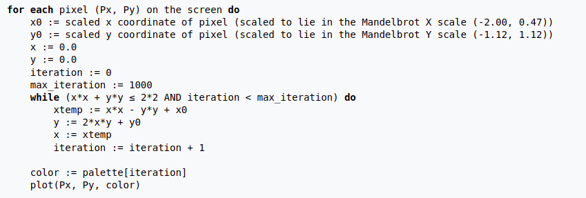

# Assignments

## Threading I
**Note: You are expected to submit each step of the assignment**
### 1. [Mandelbrot set](https://en.wikipedia.org/wiki/Mandelbrot_set)

  a. Create a pixel buffer of size 1280x720 and clear it to green color (0, 0, 255) and write it to BMP file named `image.bmp`.
BMP is a very simple image storage format. You can implement the features of BMP you need to write a BMP file using the [reference here](https://docs.microsoft.com/en-us/windows/win32/gdi/bitmap-storage). If you do not want to implement the BMP writer yourself, @Pramish-Aryal has a very easy to integrate and use [single header library here](https://github.com/Pramish-Aryal/pimp).

  b. Plot a mandelbrot set in the pixel buffer. There are [various algorithms](https://en.wikipedia.org/wiki/Plotting_algorithms_for_the_Mandelbrot_set) to implement the mandelbrot set. The pesudo code for one of the simplest method to plot mandelbrot set is as follows (for more details read, wikipedia page):


Use at least `10000` as the maximum number of iteration.

For color palette, use the following values:
```c
0.258824, 0.117647, 0.058824
0.098039, 0.027451, 0.101961
0.035294, 0.003922, 0.184314
0.015686, 0.015686, 0.286275
0.000000, 0.027451, 0.392157
0.047059, 0.172549, 0.541176
0.094118, 0.321569, 0.694118
0.223529, 0.490196, 0.819608
0.525490, 0.709804, 0.898039
0.827451, 0.925490, 0.972549
0.945098, 0.913726, 0.749020
0.972549, 0.788235, 0.372549
1.000000, 0.666667, 0.000000
0.800000, 0.501961, 0.000000
0.600000, 0.341176, 0.000000
0.415686, 0.203922, 0.011765
```

Here, you will need to index the color palette using the iteration value, which ranges from 0 to you maximum iteration (rotate the values from 0 to 15 incase the iteration value is greater than 15). Here sample 2 color values using iteration and iteration + 1 as mentioned previously. Use the position value to linearly interpolate(https://en.wikipedia.org/wiki/Linear_interpolation#Programming_language_support) between the 2 color values. To get position value, simply divide the iteration by maximum iteration count. Here's the sample code of how it might look: 
```c
uint32_t mandelbrot_color(uint32_t iterations, uint32_t max_iterations, float x, float y) {
	if (iterations < max_iterations) {
		Color color_a = Palette[iterations & 15];
		Color color_b = Palette[(iterations + 1) & 15];
		float t = (float)iterations / (float)max_iterations;
		
		Color color;
		color.r = lerp(color_a.r, color_b.r, t);
		color.g = lerp(color_a.g, color_b.g, t);
		color.b = lerp(color_a.b, color_b.b, t);

		return ColorToUint32(color);
	}
	return 0;
}
```

  c. Create another thread and plot the mandelbrot set in another thread. In the main thread, you just wait for the child thread to finish rendering, after the child thread finishes rendering, the main thread should writes the pixel buffer to BMP file.

  d. Create a shared variable of type `float` and while the child thread is rendering the mandelbrot set, it should also write the amount of progress done in that shared variable. Here progress can be something along the lines of:
```
progress = pixels_color / total_number_of_pixels;
```
The main thread should print progress in the console in regular intervals of time. You may want the main thread to sleep for few milliseconds before it reports the progress in the console, so that the main thread is not using 100% of a core.

  e. Create an optimal number of threads for your CPU (optimal number of threads == the number of cores present in your processor) and give each thread different parts of mandelbrot set to render.

Hint: Create a shared data structure were you can put the input parameters to calculate the color of a single pixel, and each thread can read from that data structure and color the single pixel.
	- Windows: https://docs.microsoft.com/en-us/windows/win32/api/sysinfoapi/nf-sysinfoapi-getsysteminfo
	- Linunx: https://man7.org/linux/man-pages/man3/sysconf.3.html

The main thread should still print progress of the plot.

  f. Convert the program such that it takes in the number of threads it should create to plot the mandelbrot set. If the input number of threads is given as 1, then only a single woker thread should render the entire mandelbrot set.

  g. Insert performance counters in your program to calculate the amount of time it requires to plot the mandelbrot set.
	- Windows: https://docs.microsoft.com/en-us/windows/win32/sysinfo/acquiring-high-resolution-time-stamps
	- Linux: https://man7.org/linux/man-pages/man3/clock.3.html

  h. Increase the number of threads gradually and observe the performance of the program. Record these data and place them in a table as such:
```
Threads, Performance
<N>, <Time>
....
```
Do this for 2 times the number of cores present in your processor.

  i. (**OPTIONAL**) Create a window and show the pixel buffer in the main thread as they are being plotted by the child threads.

Reference Links(Windows):
- Creating Window: https://docs.microsoft.com/en-us/windows/win32/learnwin32/creating-a-window
- Rendering to Window: https://docs.microsoft.com/en-us/windows/win32/api/wingdi/nf-wingdi-stretchdibits

Reference Links(SDL/Linux): https://www.libsdl.org/


### 2. Multithreading Merge Sort

  a. Read an input file named `input.txt` which will have  N numbers of type `uint32_t`. Sort them using merge sort in ascending or descing order based on the input parameters. Write the result to `sorted.txt`.
The input file will begin the number N which is the number of input numbers which are to be sorted, followed by either 'a' or 'd', where a = acsending and d = descending. After 'a' or 'd', the file will have N numbers.
Example of input file (there may be newlines in input file):
```
4 a 5 90 74 54
```
Example of output file (there shall be no newlines in output file):
```
5 54 74 90
```
Hint: In order to check if the data is correct or not, you can use [qsort](https://en.cppreference.com/w/c/algorithm/qsort) from the C runtime library and check if the sorted data are same or not.

  b. Create a total of 3 threads (excluding the main thread) and use those threads to sort the data using merge sort.
Hint: Each `Merge` in the Merge sort can be done in separated thread. You may need to create a shared data structure from where the threads get the data to be merged.

## Threading II
### 3. Mandelbrot set visualizer
(For this problem, you submit only the final code, not the intermediate steps)

1. Create a thread pool with an optimum number (N) of threads in the pool. (You may have found the optimum number from Threading I Problem 1 (h), if not use any number > 1)
2. Your task is to render the mandelbrot set (either in the screen or in BMP files)

   2.1 If you use BMP files, save them in the a directory ./output/ relative to your program, and save consecutive images with names: 01.bmp, 02.bmp, ...

   2.2 If you wish to render it (and believe me this is more fun), you may use OpenGL and/or SDL.

3. You will be using thread safe queue to push tasks for the thread pool.
4. For rendering each frame, conceptually divide the screen space into M rectangular parts, and push that information to the queue. Now your queue would be populated with M tasks.
Note: You need not set M = N. M < N would underutilize the thread pool. However, if you experiment a little you may find that some M > N may be more performant.
5. The result of the computation can be stored in a shared global buffer and directly rendered by OpenGL. Here you don't need to lock the global buffer because, each thread writes to an independent portion of the buffer while rendering a frame.
6. First, draw the mandelbrot set with center of screen focused at point -1.4+0i and scale 10^-2 (i.e. 0+0i to 1+0i in the mandlebrot set takes 100 pixels).
7. For each frame, you follow the following procedure:

   7.1. In the main thread, divide the screen to M rectangular regions.

   7.2. Set a global counter (made thread safe using a mutex) to 0.

   7.3 Push the tasks (i.e. info about regions) into the queue

   7.4 Threads from thread pool, pop a task from the queue, complete the computation and atomically increment the global counter by 1.

   7.5 The main thread waits for the counter to be equal to M i.e. it waits for all task on the queue to be complete.

   7.6 If you are rendering to BMP file, save the buffer into a BMP file. And if you are rendering to screen, tell OpenGL to render it to screen.

   7.7 If rendering to screen, wait for any keyboard input and then scale by a factor of 2. i.e. divide scale value by 2. If rendering to BMP, you need not wait for any input.

   7.8 Stop after scaling 14 number of times.

8. (Optional) If you implemented screen rendering, its not too much of a task to allow panning and zoom in & out. For that use three shared global variables: scale, translationX and translationY. After rendering each frame, the main thread waits for a key press and depending upon the key, changes the three values.
```
| Key | Operation              |
|-----|------------------------|
| a   | decrement translationX |
| d   | increment translationX |
| s   | decrement translationY |
| w   | increment translationY |
| k   | scale := scale / 2     |
| l   | sacle := scale * 2     |
```
