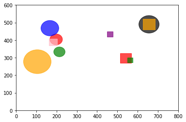

## Assgnment 1

Implement a simple calculator program using callbacks.
The calculator function should should operate on two numbers based on callback it recieves.
The skeleton with main function is already given in the file 'srcCallbacks.c'.
Fill in the parts needed.
In the main function,
**add lines only in the commented area**
**you can add further parameters to the calculator function if needed**

Output in terminal should be as follows

```
Enter int a:
4
Enter int b:
9
Choose:
 1 for addition
 2 for subtraction
 3 for multiplication
 4 for division
2
subtraction of: 4 and 9 is -5
```

## Assignment 2

Implement collision detection functions for various objects given in the [input.csv](input.csv) file. The [input.csv](input.csv) file is of the following format.

| ShapeID | ShapeType | CenterX | CenterY | Radius/Length |
| ------- | --------- | ------- | ------- | ------------- |
| 1       | 0         | 198     | 404     | 31            |
| 2       | 0         | 656     | 490     | 50            |
| .       | .         | .       | .       | .             |
| .       | .         | .       | .       | .             |
| .       | .         | .       | .       | .             |
| 6       | 1         | 182     | 389     | 40            |
| .       | .         | .       | .       | .             |

Here **ShapeType** indicates whether the **Object** has the shape of a Circle (indicated by 0) or a Square (indicated by 1). Input all the objects from the file and check for collision detection among the pair of objects according to their shapes and other specifications. The output should display '1' when collision occurs and '0' when collision does not occur and should be of the following format.

```
0   0   1   0   1   0   0   0   0
0   0   0   0   1   0   0   0
.
.
.
0   0
1
```

**Use both, switch case and function dispatch, for finding collision between various shapes.**

<hr>

_Hint: The shapes, when plotted, look something like this._


